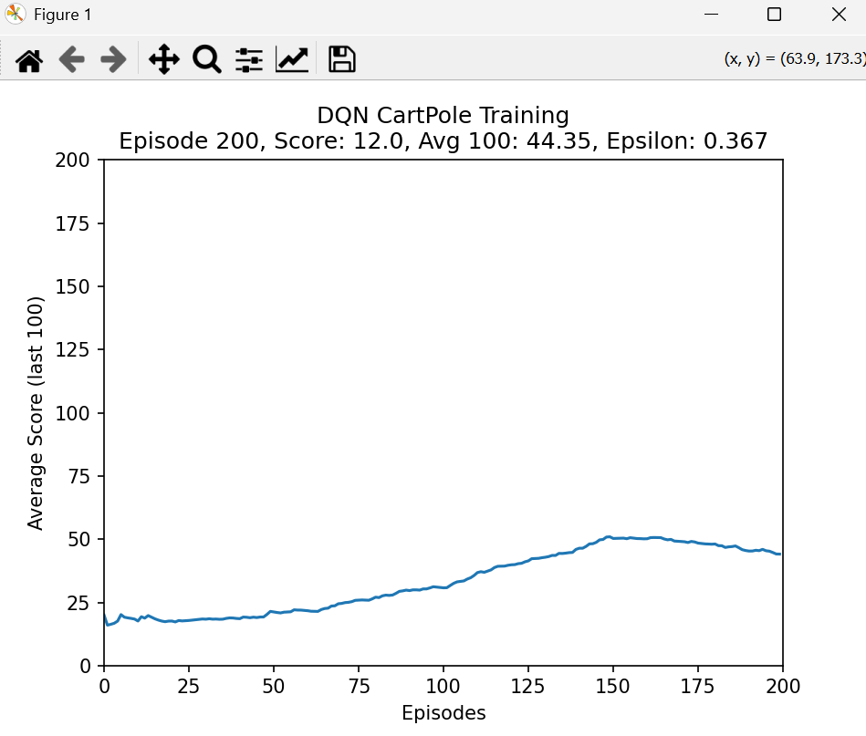

# Deep-q-learning-cartpole
Deep Q-Network agent that learns to balance a pole using reinforcement learning

# 🤖 Deep Q-Learning — CartPole-v1

A Deep Q-Network (DQN) agent trained to solve the CartPole-v1 environment from Gymnasium. The agent learns to balance a pole on a moving cart using reinforcement learning, with a live training visualization updated in real time.

---

## 📸 Screenshots

### Training Curve

*Average score over the last 100 episodes — the agent steadily improves as epsilon decays and exploration gives way to learned policy.*

### CartPole in Action
https://github.com/VelosoMiguel/deep-q-learning-cartpole/assets/cartpole_demo.mp4

*The trained agent balancing the pole in the CartPole-v1 environment.*

---

## 🧠 How It Works

DQN combines Q-Learning with a deep neural network to approximate the Q-value function — the expected cumulative reward for taking an action in a given state.

**Key components:**

| Component | Description |
|---|---|
| **Policy Network** | 3-layer fully connected network that predicts Q-values for each action |
| **Target Network** | A copy of the policy network updated every N steps — stabilizes training |
| **Replay Buffer** | Stores past experiences and samples random mini-batches to break correlation |
| **Epsilon-Greedy** | Balances exploration (random actions) vs exploitation (learned policy) |
| **Huber Loss** | Robust loss function that handles outliers better than MSE |

**Training loop:**
1. Agent observes the current state (cart position, velocity, pole angle, angular velocity)
2. Selects action using epsilon-greedy policy
3. Stores transition `(state, action, reward, next_state, done)` in replay buffer
4. Samples random mini-batch and updates the policy network
5. Periodically copies policy network weights to target network
6. Decays epsilon each episode to reduce exploration over time

---

## ⚙️ Hyperparameters

| Parameter | Value | Description |
|---|---|---|
| `BUFFER_SIZE` | 5,000 | Replay buffer capacity |
| `BATCH_SIZE` | 32 | Mini-batch size |
| `GAMMA` | 0.99 | Discount factor |
| `EPS_START` | 1.0 | Initial exploration rate |
| `EPS_END` | 0.01 | Minimum exploration rate |
| `EPS_DECAY` | 0.995 | Epsilon decay per episode |
| `LEARNING_RATE` | 1e-3 | Adam optimizer learning rate |
| `TARGET_UPDATE` | 200 | Steps between target network updates |
| `NUM_EPISODES` | 200 | Maximum training episodes |

---

## 🚀 How to Run

**Clone the repository:**
```bash
git clone https://github.com/VelosoMiguel/deep-q-learning-cartpole.git
cd deep-q-learning-cartpole
```

**Install dependencies:**
```bash
pip install -r requirements.txt
```

**Train the agent:**
```bash
python Deep_Q-Learning.py
```

The CartPole simulation window and the live training plot will open automatically. Training stops early if the agent reaches an average score of 195 over the last 100 episodes (the solve threshold).

---

## 📁 Project Structure

```
├── Deep_Q-Learning.py    # Main training script
├── requirements.txt      # Python dependencies
├── training_curve.png  # Training progress graph
└── cartpole_demo.gif   # Agent in action
```

---

## 🛠️ Built With

- **Python** — core language
- **PyTorch** — neural network and training
- **Gymnasium** — CartPole-v1 environment
- **Matplotlib** — live training visualization
- **NumPy** — numerical operations

---

## 🔮 Future Improvements

- [ ] Implement Double DQN to reduce Q-value overestimation
- [ ] Add Dueling DQN architecture for better value estimation
- [ ] Try Prioritized Experience Replay for more efficient learning
- [ ] Test on more complex Gymnasium environments (LunarLander, MountainCar)
- [ ] Save and load trained model weights

---

## 👤 Author

**Miguel Veloso**  
[GitHub](https://github.com/VelosoMiguel) · [LinkedIn](https://www.linkedin.com/in/miguel-veloso-91355b372/)
